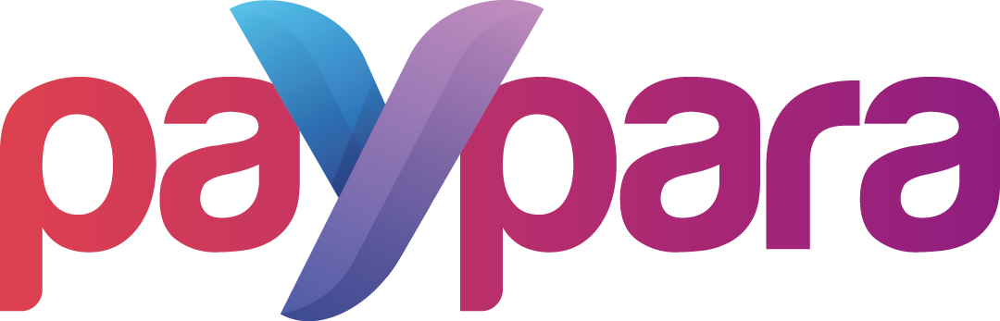

 

  

 

## Getting Started

- Clone this repository
- Run `composer install` to install php modules
- Run `yarn install` to install node modules
- Run `yarn build` to build the frontend assets

## Setup Local Dev Environment
- To setup your local development environment with ddev:
  - Install docker and ddev using the [docs](https://ddev.readthedocs.io/en/stable/)
  - Run `ddev start` to start the project
  - Run `ddev restart` to restart the project
  - Run `ddev status` to get the detailed information
  - Run `ddev ssh` and `ping db` to find out the db ip address

## Server Requirements

PHP version 8.0 is required, with the following extensions installed:

- [intl](http://php.net/manual/en/intl.requirements.php)
- [libcurl](http://php.net/manual/en/curl.requirements.php)
- [mbstring](http://php.net/manual/en/mbstring.installation.php)

## License

Paypara is released under the proprietary license and it is confidential.

Unauthorized copying, transferring or reproduction of the contents of this project, via any medium is strictly prohibited.

See [LICENSE](https://github.com/bozoknet/dev.paypara.co/blob/master/LICENSE) for more information.
